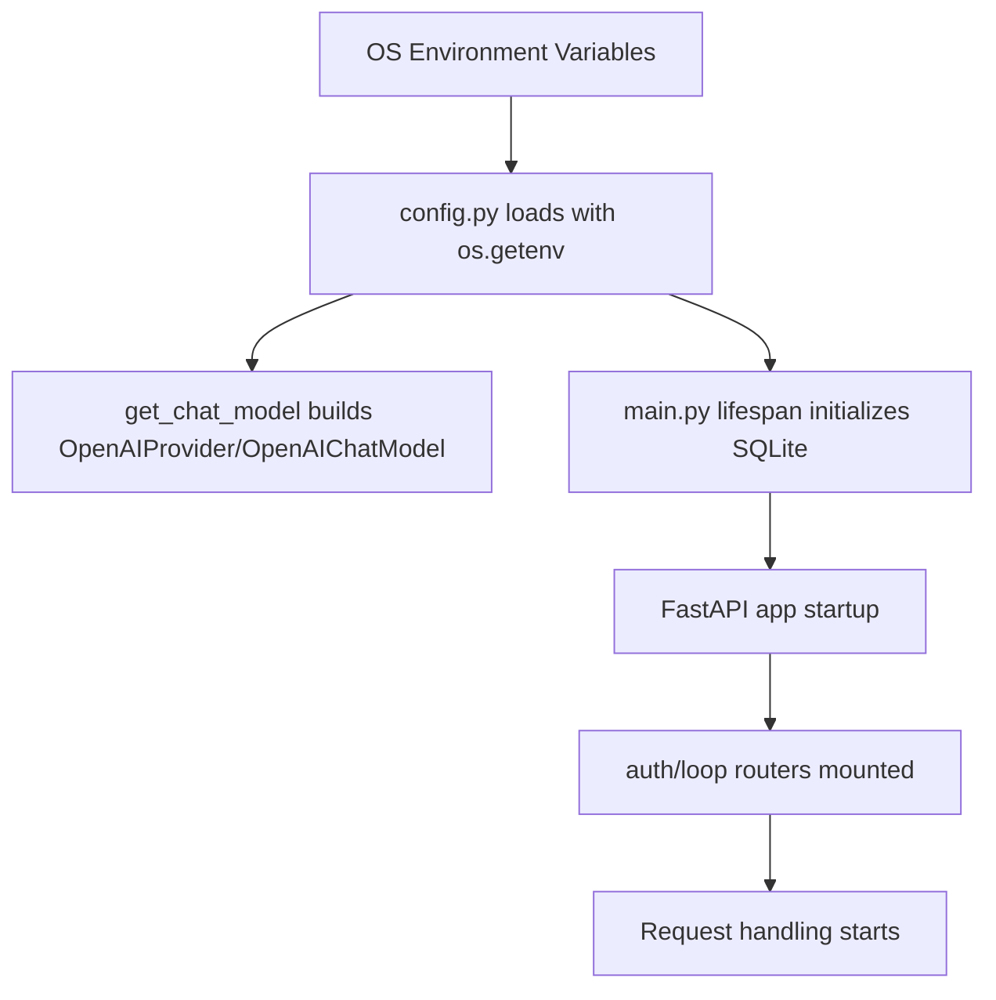

# Stage 1: Infrastructure - 全链路深度拆解

## 0. 逻辑流转图 (Workflow Diagram)


## 第一部分：核心解析

### 单元 1: 配置装配与内存对象生命周期 (`config.py`)
```python
BASE_DIR = Path(__file__).resolve().parent
APP_NAME = os.getenv("APP_NAME", "Agentist")
DATABASE_PATH = os.getenv("DATABASE_PATH", str(BASE_DIR / "project.db"))
JWT_SECRET = os.getenv("JWT_SECRET", "")
MODEL_PROVIDER_API_KEY = os.getenv("MODEL_PROVIDER_API_KEY", "")
```

逐行解析:
- `Path(__file__)` 取当前模块文件路径，`resolve()` 触发 OS 路径规范化（符号链接、相对段折叠），最终是绝对路径对象。
- `parent` 返回上级目录，不复制文件内容，仅创建新的 `Path` 轻量对象（引用字符串，低成本）。
- `os.getenv` 在进程环境变量表中读取键值；在 Windows 下对应当前进程继承的环境块，读取不到才走默认值。
- `DATABASE_PATH` 默认拼接到工作目录，确保本地 MVP 可启动。
- `JWT_SECRET` 空字符串是开发便捷策略，但生产风险高（会导致可预测签名）。

行号定位:
- `config.py` 约 9-22 行是配置加载核心。

工程化建议:
- 当前实现是“模块级全局配置”，简单但耦合。主流方案是 `pydantic-settings`，将配置模型化，支持类型校验和环境分层。

### 单元 2: 模型工厂函数 (`config.py`)
```python
def get_chat_model() -> OpenAIChatModel:
    if not MODEL_PROVIDER_API_KEY:
        raise RuntimeError("Missing MODEL_PROVIDER_API_KEY...")

    provider = OpenAIProvider(
        base_url=MODEL_BASE_URL,
        api_key=MODEL_PROVIDER_API_KEY,
    )
    return OpenAIChatModel(MODEL_NAME, provider=provider)
```

逐行解析:
- `if not MODEL_PROVIDER_API_KEY` 是 fail-fast 保护，防止下游 SDK 在运行时晚失败。
- `OpenAIProvider` 是传输层配置对象（base_url + api_key）。
- `OpenAIChatModel` 将 provider 与模型名绑定，返回可复用实例。

底层库行为:
- 外部字符串（环境变量）先存入 Python `str`，再由 SDK 组装 HTTP client 配置。
- `pydantic-ai` 后续把 Python 对象序列化为 JSON body 发给模型服务。

### 单元 3: 启动生命周期 (`main.py`)
```python
@asynccontextmanager
async def lifespan(_: FastAPI):
    setup_database(db_path=DATABASE_PATH)
    yield

app = FastAPI(title=APP_NAME, lifespan=lifespan)
app.include_router(auth_router)
app.include_router(loop_router)
```

逐行解析:
- `@asynccontextmanager` 让函数实现异步上下文协议（进入/退出生命周期钩子）。
- `setup_database(...)` 在启动前执行建表，避免首次请求时延迟建表。
- `yield` 之前是启动逻辑，之后可放关闭清理逻辑。
- `include_router` 将业务路由挂到统一 app。

工程化建议:
- 启动阶段应增加配置健康检查（JWT 密钥、模型配置、数据库可写）。

## 第二部分：Under-the-Hood 专题

### Python 内存模型（本阶段必须掌握）
- 模块导入时，`config.py` 顶层变量只初始化一次，存于模块对象命名空间。
- 其他模块 `from config import DATABASE_PATH` 是引用该对象绑定值，不是深拷贝。
- 若运行期动态改环境变量，已有模块常量不会自动刷新。

### 本阶段必须掌握的新表达 / 协议 / 概念
- `@asynccontextmanager`：把一个异步函数变成“可进入 / 可退出”的生命周期上下文。
- `async def lifespan(_: FastAPI)`：`_` 表示参数被接收但不在函数体内使用，强调这里关注的是 FastAPI 的生命周期协议，而不是入参本身。
- `yield` 在 `lifespan` 里表示启动阶段和关闭阶段的分界点，前面做初始化，后面做清理。
- `FastAPI(lifespan=...)`：不是普通构造参数，而是把一个生命周期钩子协议挂到应用实例上。
- 这类表达不只是“写法”，它们对应的是框架协议、对象边界和执行顺序，必须单独讲清楚。

### `__new__` vs `__init__` 与本项目关系
```python
class C:
    def __new__(cls, *args, **kwargs):
        return super().__new__(cls)

    def __init__(self):
        self.x = 1
```
- `__new__` 负责分配对象内存。
- `__init__` 负责初始化对象状态。
- 本项目虽未自定义这两个方法，但你在实现“配置单例”Core Lab 时会用到 `__new__` 控制唯一实例。

### `super()` 与 MRO
- `super()` 沿 MRO（方法解析顺序）向上查找父类实现。
- 多继承场景中，MRO 决定调用链，避免重复初始化。
- 后续你写中间件或基础服务类时，需要 cooperative multiple inheritance 模式。

## 第三部分：关联跳转
- `main.py` 启动时会跳转 `db.py:setup_database` 执行建表。
- 路由挂载后请求会跳转 `auth.py` 和 `loop.py`。

## MVP 实战 Lab：配置系统工程化改造
- 任务背景: 配置是后端故障的最高频来源之一。
- 需求规格:
  - 输入: 环境变量。
  - 输出: 类型安全配置对象。
  - 异常: 缺失关键密钥时抛出可读错误。
- 参考路径: `config.py`, `main.py`。
- 提交要求:
  - 在 `docs/study_notes/labs/lab_stage1_core.py` 实现 `Config` 单例（`__new__`）+ `from_env()`。
  - 打印加载结果并模拟缺失密钥失败日志。
    - 额外写 1 段简短说明，解释 `@asynccontextmanager` / `lifespan` / `yield` 这组表达分别在协议层面做了什么。

### Applied Lab（可选）
- 场景: 把配置系统复用于日志器（按环境切换日志级别）。
- 文件建议: `docs/study_notes/labs/lab_stage1_applied.py`。

## 引导式 Review Hint
1. 你的 `__new__` 是否保证并发下仍只创建一个实例？
2. 你是否把“生产必须配置项”与“开发可选项”分层处理了？
