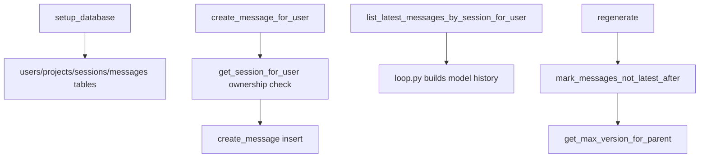

# Stage 2: Data Focus - 全链路深度拆解

## 0. 逻辑流转图 (Workflow Diagram)


## 第一部分：核心解析

### 单元 1: 连接配置与事务封装 (`db.py`)
```python
def _configure_connection(conn: sqlite3.Connection) -> None:
    conn.execute("PRAGMA foreign_keys=ON;")
    conn.execute("PRAGMA journal_mode=WAL;")
    conn.execute("PRAGMA synchronous=OFF;")
    conn.row_factory = sqlite3.Row

@contextmanager
def db_cursor(db_path: str = "project.db"):
    conn = get_connection(db_path)
    cursor = conn.cursor()
    try:
        yield cursor
        conn.commit()
    except Exception:
        conn.rollback()
        raise
    finally:
        conn.close()
```

逐行解析:
- `foreign_keys=ON` 开启外键约束，否则 SQLite 默认不强制。
- `WAL` 提升并发读写能力。
- `synchronous=OFF` 提速但降低断电安全，生产需谨慎。
- `contextmanager` 把事务控制统一封装，避免散落的 commit/rollback。

行号定位:
- `db.py` 约 7-34 行。

### 单元 2: Schema 与版本字段 (`db.py`)
```python
CREATE TABLE IF NOT EXISTS messages (
    msg_id TEXT PRIMARY KEY,
    sid TEXT NOT NULL,
    kind TEXT NOT NULL,
    raw_json TEXT NOT NULL,
    msg_timestamp REAL NOT NULL,
    msg_time TEXT NOT NULL,
    parent_msg_id TEXT,
    version INTEGER DEFAULT 1,
    is_latest INTEGER DEFAULT 1,
    ...
);
```

逐行解析:
- `parent_msg_id` 建立“同一次用户输入的回复分支”。
- `version` 是分支内序号。
- `is_latest` 充当“当前展示版本”的游标位。

工程化建议:
- `is_latest` 可用部分索引 + 唯一约束加强一致性（同 parent 仅 1 条 latest）。

### 单元 3: 用户归属校验写入 (`db.py`)
```python
def create_message_for_user(...):
    owned_session = get_session_for_user(sid=sid, user_uuid=user_uuid, db_path=db_path)
    if owned_session is None:
        raise PermissionError("Session does not belong to the current user.")
    return create_message(...)
```

逐行解析:
- 先校验所有权，再写入，避免越权写。
- 抛 `PermissionError`，上层 `loop.py` 转成统一 HTTP 错误。

### 单元 4: 最新消息读取与分页 (`db.py`)
```python
def list_latest_messages_by_session_for_user(...):
    ...
    WHERE m.sid = ? AND p.user_uuid = ? AND m.is_latest = 1
    ORDER BY m.msg_timestamp ASC
```

逐行解析:
- 同时过滤会话、用户、latest，确保 AI 只看到当前分支历史。

## 第二部分：Under-the-Hood 专题

### Python 对象与 sqlite3.Row
- `sqlite3.Row` 本质是映射视图对象，字段名索引比裸 tuple 可读性高。
- `_row_to_dict` 把 Row 显式拷贝成 `dict`，代价是多一次分配，但换来上层稳定接口。

### 异常捕获真实意图
- `db_cursor` 统一回滚所有异常，保证事务原子性。
- 重新抛出异常而不是吞掉，保持调用栈可观测。

### 路径/系统交互
- `db_path` 是 OS 文件路径，SQLite 会在该路径打开或创建数据库文件。

## 第三部分：关联跳转
- `loop.py` 调用 `list_latest_messages_by_session_for_user` 构建模型历史。
- `auth.py` 调用 `get_user_by_email/get_user_by_uuid` 完成认证。

## MVP 实战 Lab：最小仓储抽象
- 任务背景: 目前 SQL 集中但重复较多，重构成本会上升。
- 需求规格:
  - 输入: `sid`, `user_uuid`。
  - 输出: latest 消息列表。
  - 异常: 非法用户返回空或抛权限错误。
- 参考路径: `db.py`, `loop.py`。
- 提交要求:
  - 在 `docs/study_notes/labs/lab_stage2_core.py` 写 `MessageRepository`（含 `list_latest_for_user` + `create_for_user`）。
  - 给出最小调用样例日志。

### Applied Lab（可选）
- 场景: 给分页查询增加游标分页（基于 `msg_timestamp`）。

## 引导式 Review Hint
1. 你是否把权限校验放在“写入之前”而不是写入之后？
2. 你如何保证同一 parent 只会有一个 latest 版本？
