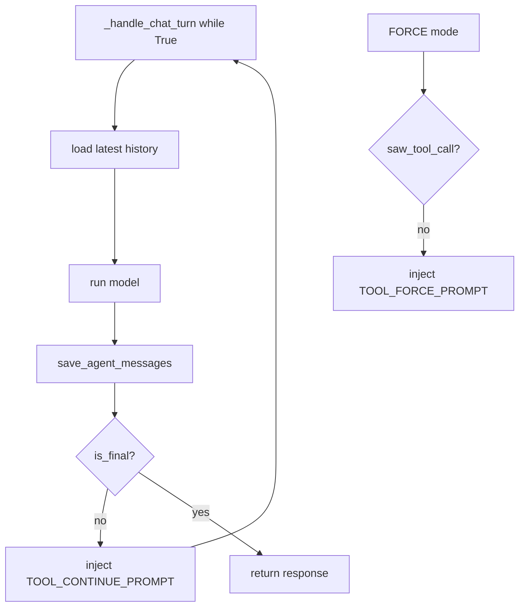

# Stage 5: Reliability - 全链路深度拆解

## 0. 逻辑流转图 (Workflow Diagram)


## 第一部分：核心解析

### 单元 1: 循环控制变量 (`loop.py`)
```python
total_tool_calls = 0
orchestration_round = 0
saw_tool_call = False

while True:
    remaining_tool_calls = MAX_TOOL_LOOPS - total_tool_calls
    if remaining_tool_calls < 0:
        _raise_api_error(status_code=429, code="TOOL_LOOP_LIMIT_EXCEEDED", ...)
```

逐行解析:
- `total_tool_calls` 防止工具调用总量失控。
- `orchestration_round` 防止“无工具但持续循环”的路径。
- 双计数器比单计数器更稳健。

### 单元 2: FORCE 模式守卫 (`loop.py`)
```python
if payload.tool_mode == ToolMode.FORCE and not saw_tool_call:
    orchestration_round += 1
    if orchestration_round > MAX_TOOL_LOOPS:
        _raise_api_error(...)
    route_message = ModelRequest(parts=[UserPromptPart(content=TOOL_FORCE_PROMPT)])
    create_message_for_user(..., kind="route_user", ...)
    continue
```

逐行解析:
- FORCE 模式下，模型必须至少调用一次工具。
- 若模型不调用，则注入系统提示并继续下一轮。

### 单元 3: 版本一致性 (`db.py` + `loop.py`)
```python
mark_messages_not_latest_after(sid=sid, msg_timestamp=target_timestamp)
new_version = get_max_version_for_parent(parent_msg_id=payload.target_msg_id) + 1
...
create_message_for_user(..., parent_msg_id=payload.target_msg_id, version=new_version)
```

逐行解析:
- regenerate 先清旧 latest，再生成新版本，避免历史污染。
- 新版本号基于同 parent 最大值递增。

## 第二部分：Under-the-Hood 专题

### 布尔逻辑拆解
- `if is_final:` 是主出口。
- `if payload.tool_mode == FORCE and not saw_tool_call:` 是强制工具的补充出口。
- 两个条件互不等价，分别保证“任务完成性”和“策略约束性”。

### 异常意图
- 429 不是“系统崩溃”，而是“保护系统不被无限循环拖垮”的设计。

### Python 内存与循环
- `while True` 中的局部变量绑定在函数栈帧，循环迭代复用绑定名，避免频繁创建新的作用域对象。

## 第三部分：关联跳转
- `loop.py:regenerate_message` -> `db.py:mark_messages_not_latest_after` -> `db.py:get_max_version_for_parent`。
- `loop.py:_handle_chat_turn` -> `save_agent_messages` -> `db.py:create_message_for_user`。

## MVP 实战 Lab：可验证的循环守卫器
- 任务背景: 可靠性问题通常在边界条件。
- 需求规格:
  - 输入: `tool_in_progress` 序列、最大轮次。
  - 输出: 是否正常退出、退出原因。
  - 异常: 超限时返回结构化错误。
- 参考路径: `loop.py`, `db.py`。
- 提交要求:
  - 在 `docs/study_notes/labs/lab_stage5_core.py` 实现 `LoopGuard`（包含 `step()` 和 `should_abort()`）。
  - 用 2 组数据验证：正常退出、超限退出。

### Applied Lab（可选）
- 场景: 为版本切换加入审计日志（记录操作者、切换前后 msg_id）。

## 引导式 Review Hint
1. 你的守卫是“按工具调用次数”还是“按编排轮次”触发，为什么？
2. regenerate 后你如何证明只有一个 `is_latest=1`？
