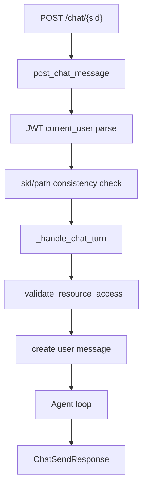

# Stage 6: Orchestration - 全链路深度拆解

## 0. 逻辑流转图 (Workflow Diagram)


## 第一部分：核心解析

### 单元 1: HTTP 入口防线 (`loop.py`)
```python
@router.post("/chat/{sid}")
def post_chat_message(sid: str, payload: ChatSendRequest, current_user: dict[str, Any] = Depends(get_current_user)):
    request_id = str(uuid.uuid4())
    if sid != payload.sid:
        _raise_api_error(status_code=409, code="SESSION_CONFLICT", ...)
```

逐行解析:
- URL 与 body 双写 sid，先做一致性校验，防止请求篡改。
- `request_id` 贯穿错误对象，便于追踪。

### 单元 2: 权限与资源一致性 (`loop.py`)
```python
def _validate_resource_access(...):
    project = get_project_for_user(pid=pid, user_uuid=user_uuid, db_path=DATABASE_PATH)
    if project is None:
        _raise_api_error(status_code=404, code="RESOURCE_NOT_FOUND", ...)

    session = get_session_for_user(sid=sid, user_uuid=user_uuid, db_path=DATABASE_PATH)
    if session is None or session.get("pid") != pid:
        _raise_api_error(status_code=404, code="RESOURCE_NOT_FOUND", ...)
```

逐行解析:
- 项目和会话都按用户过滤。
- 统一返回 404 可减少资源枚举攻击信息。

### 单元 3: 编排器职责边界
```python
# _handle_chat_turn 职责
# 1) 权限校验
# 2) 用户消息入库
# 3) 工具权限计算
# 4) Agent 循环
# 5) 标准响应
```

解析:
- 当前单函数职责偏重，已经接近“巨型编排器”临界点。
- 建议拆为 `AccessService`, `HistoryService`, `AgentOrchestrator` 三段。

## 第二部分：Under-the-Hood 专题

### 依赖注入 (Depends) 的真实含义
- `Depends(get_current_user)` 是 FastAPI 请求期依赖解析。
- 每个请求都独立执行依赖函数，结果注入到处理器参数。

### 本阶段必须掌握的新表达 / 协议 / 概念
- `Depends(...)`：不是普通函数调用，而是 FastAPI 的请求级依赖协议。
- `current_user: dict[str, Any] = Depends(get_current_user)`：把依赖结果直接注入参数位，理解它比记住语法更重要。
- `request_id`：这里代表跨错误、日志、追踪链路的关联键，不只是一个随机字符串。
- `_handle_chat_turn`：前缀下划线表示这是编排内部步骤，不是公开 API。
- 这类点需要在 stage 里单独讲，帮助读者把“写法”与“框架协议”区分开。

### 内存与对象边界
- `ChatSendRequest` 是 Pydantic 对象，入参先 JSON -> Python dict -> 验证后模型实例。
- `model_dump`（错误对象）会把对象重新转为原生 dict 供 HTTP JSON 输出。

### `super()`/MRO 在编排重构中的作用
- 若后续定义 `BaseOrchestrator` + `ChatOrchestrator`，需要 `super().__init__()` 保持父类依赖初始化链。

## 第三部分：关联跳转
- `main.py` 路由挂载后进入 `loop.py:post_chat_message`。
- `post_chat_message` 依赖 `auth.py:get_current_user`。
- `_handle_chat_turn` 多次调用 `db.py` 读写接口。

## MVP 实战 Lab：拆分型编排器
- 任务背景: 编排逻辑增长最快，最易退化。
- 需求规格:
  - 输入: `payload`, `user_uuid`。
  - 输出: `assistant_message`。
  - 异常: 保持标准错误格式。
- 参考路径: `loop.py`。
- 提交要求:
  - 在 `docs/study_notes/labs/lab_stage6_core.py` 中把流程拆成 `validate`, `persist_user_input`, `run_once` 三函数。
  - 保持外部行为不变（输入输出字段一致）。
  - 额外补一段说明，解释 `Depends(get_current_user)` 为什么属于请求期协议，而不是普通函数实参。

### Applied Lab（可选）
- 场景: 加一个审计中间件记录每次请求耗时和 request_id。

## 引导式 Review Hint
1. 你拆分后，函数间是否还有隐式全局状态耦合？
2. 错误对象字段是否仍统一（`code/message/request_id/retryable`）？
