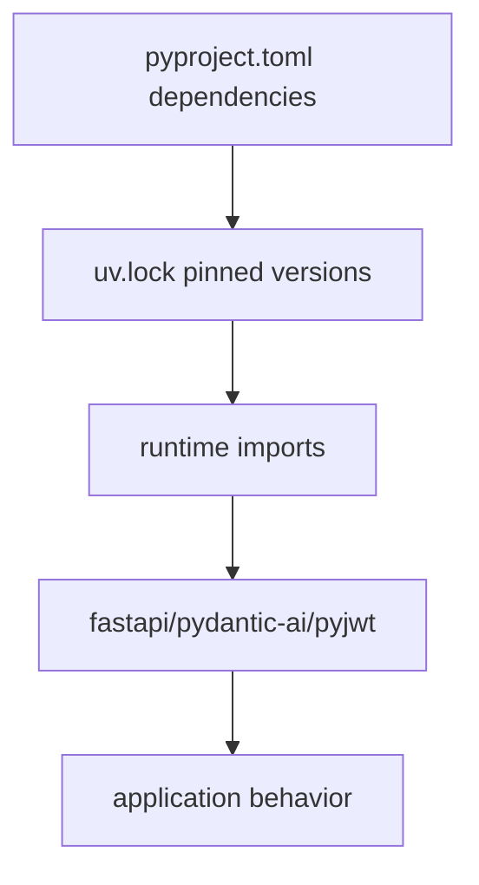

# Stage 8: Third-party Assets - 全链路深度拆解

## 0. 逻辑流转图 (Workflow Diagram)


## 第一部分：核心解析

### 单元 1: 依赖声明与锁定 (`pyproject.toml`, `uv.lock`)
```python
dependencies = [
    "fastapi>=0.135.2",
    "pydantic-ai>=1.70.0",
    "pydantic-ai-skills>=0.6.0",
    "uv>=0.11.0",
]
```

逐行解析:
- `>=` 表示宽版本策略，开发方便但可能引入隐式升级风险。
- `uv.lock` 负责把解析后的精确版本钉住，保障可复现。

### 单元 2: 实际使用 vs 声明使用
- 当前代码明确 import 了 `fastapi`, `pydantic_ai`，也在运行时使用。
- `pydantic-ai-skills` 在当前源码中未直接 import，需评估是否预留依赖。
- `uv` 更偏构建工具，不是业务运行时核心包。

### 单元 3: 工程化治理建议
- 区分 runtime dependencies 与 dev dependencies。
- 建立“声明依赖与实际 import 差异审计”脚本。
- 对关键依赖设上限区间，减少大版本破坏。

## 第二部分：Under-the-Hood 专题

### 包管理到内存对象
- 安装阶段: wheel/unpacked files 到虚拟环境目录。
- 运行阶段: `import` 触发模块加载，创建模块对象并缓存于 `sys.modules`。
- 后续重复 import 复用缓存对象，不重复执行模块顶层代码。

### 路径与 OS 交互
- `.venv` 是隔离解释器与 site-packages 的目录。
- `PATH` 与 Python 启动器决定使用哪个解释器执行项目。

### 风险控制
- 锁文件应纳入版本控制。
- 定期审计 CVE 与破坏性变更公告。

## 第三部分：关联跳转
- `pyproject.toml` 定义依赖 -> `config.py/auth.py/loop.py` 实际调用对应库。

## MVP 实战 Lab：依赖审计最小工具
- 任务背景: 依赖膨胀会带来安全和维护成本。
- 需求规格:
  - 输入: 项目源码目录 + 依赖声明列表。
  - 输出: 已使用/未使用依赖清单。
  - 异常: 解析失败时给出可读提示。
- 参考路径: `pyproject.toml`, `scan-output/AIssistant-backend.md`。
- 提交要求:
  - 在 `docs/study_notes/labs/lab_stage8_core.py` 编写简单扫描器（正则扫描 `import`）。
  - 输出 Markdown 报告到控制台。

### Applied Lab（可选）
- 场景: 把依赖审计接入 pre-commit。

## 引导式 Review Hint
1. 你如何定义“真正使用的依赖”？仅 import 就算，还是运行路径覆盖到才算？
2. 你是否区分了构建工具依赖与业务运行依赖？
